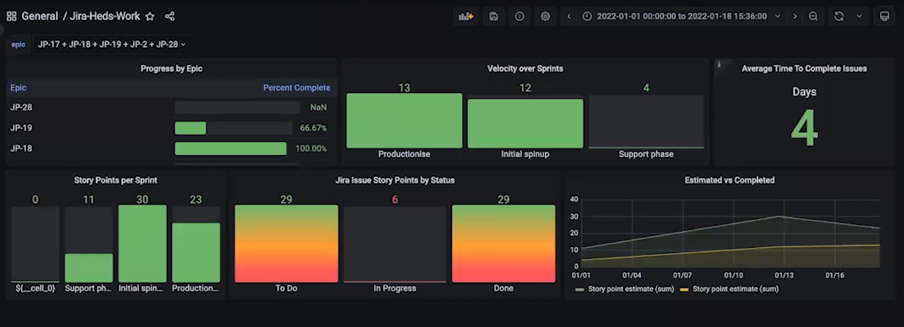

# Grafana

---

[Grafana](https://grafana.com/grafana/) — это платформа с открытым исходным кодом для визуализации, мониторинга и анализа данных.
Платформа не хранит их и не собирает — она является универсальным клиентом для систем хранения метрик.

Платформу можно подключать к любому источнику данных, например, Prometheus, Graphite, OpenTSDB, InfluxDB, Elasticsearch.
Перечень встроенных источников ([полный список на английском](https://grafana.com/docs/grafana/latest/datasources/#built-in-core-data-sources)) может быть расширен при помощи сторонних плагинов.

Grafana подключается к источнику данных и выполняет заданные запросы.
Полученные результаты Grafana показывает в доступном виде.

## Основные функции

Основные функции Grafana включают:

* **Визуализация данных:** Grafana предоставляет различные способы визуализации данных, включая графики, гистограммы, тепловые карты и другие. 

    Подробнее смотрите таблицу с элементами визуализации в Grafana.

* **Анализ изменений:** с помощью Grafana вы можете отслеживать изменения метрик во времени.

* **Оповещения:** Grafana позволяет настроить отправку автоматических оповещений.

Элементы визуализации в Grafana:

| Тремин | Описание |
| --- | --- |
| Панель | Базовый элемент визуализации выбранных показателей. Поддерживает различные типы визуализации данных, такие как графики, статусы, таблицы, тепловые карты и текст, а также интеграцию с плагинами и приложениями. Пользователь может настраивать стиль и формат каждой панели, перемещать и изменять их размер. |
| Дашборд | Представляет собой набор панелей, размещенных в сетке с переменными, позволяющими переключать отображаемые данные. Дашборды можно настраивать и секционировать. В Grafana доступен большой выбор готовых дашбордов для разных типов данных и источников. |
| Аннотации | Аннотации позволяют отмечать точки на графике с множеством событий. По наведению курсора на аннотацию можно получить описание события и теги события. |

## Пример использования

Рассмотрим пример использования Grafana — дашборд задач трекера Jira.
Он был построен при помощи встроенного плагина Grafana для работы с Jira.

На этом дашборде можно увидеть следующие панели:

* прогресс по эпикам;
* распределение задач по спринтам;
* среднее время работы над задачами;
* общее количество Story Points задач разных спринтов;
* распределение задач по статусам (выражено в Story Points задач);
* соотношение общего количества задач к выполненным (выражено в Story Points задач).

Grafana может быть использована для отслеживания производительности и состояния более сложных сервисов, систем и приложений, а также их компонентов.

При настройке собственных дашбордов необходимо знать, какие метрики отдает сервис и как их можно настроить.
Обычно эту информацию можно найти в документации сервиса.